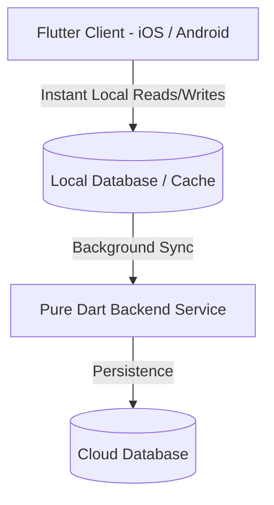

<div align="center">

# 🏹 QuiverWorks

**A lightning-fast, local-first companion app for D&D 5e and 5.5e character management.**

[](https://flutter.dev/)
[](https://dart.dev/)
[](#)
[](#)

</div>

---

## ⚡ Overview

**QuiverWorks** is an end-to-end Dart ecosystem (Flutter mobile client + pure Dart backend) designed to make digital sheet management snappy and responsive at the game table. 

Built with an offline-first architecture, it ensures instant interactions, zero loading spinners during combat, and smooth background cloud syncing.

---

## ✨ Key Features

* **⚡ Instant Responsiveness:** Local-first data caching ensures sheets load instantly without waiting on network calls mid-session.
* **📜 Dual Ruleset Support:** Built from the ground up to support both **D&D 5e** and the **2024 Revised Rules (5.5e)** seamlessly.
* **🛠️ Deep Homebrew Builder:**
  * Create custom items, weapons, and wondrous gear with custom modifiers.
  * Full homebrew support for custom classes, subclasses, and feat progression.
* **📊 Comprehensive Live Tracking:**
  * Dynamic spell slot tracking and preparation lists.
  * Real-time HP, temporary HP, hit dice, and death save tracking.
  * Encumbrance and categorized inventory management.
* **🔄 Background Cloud Sync:** Play completely offline; changes sync cleanly to the Dart backend once connectivity resumes.

---

## 🛠️ Architecture & Tech Stack



* **Frontend:** Flutter & Dart
* **Backend:** Pure Dart (Server-side Dart API / sync service)
* **Architecture:** Offline-First / Local-First with optimistic UI updates

---

## 🚀 Getting Started

> *Note: This project is in active development. Detailed build pipelines and environment setup will be updated as the backend service stabilizes.*

### Prerequisites

* [Flutter SDK](https://docs.flutter.dev/get-started/install) (Latest Stable)
* [Dart SDK](https://dart.dev/get-started/sdk) (3.x+)
* Android Studio / Xcode for device simulation

### Basic Setup

1. **Clone the repository:**
   ```bash
   git clone git@github.com:your-username/quiver-works.git
   cd quiver-works
   ```

2. **Install Flutter dependencies:**
   ```bash
   flutter pub get
   ```

3. **Run on a connected device/emulator:**
   ```bash
   flutter run
   ```

---

## 🗺️ Roadmap

Milestone 1: Core Domain Models & Rules (Pure Dart)
- [x] Ability scores, modifiers, and point buy validation
- [x] Proficiencies, skills, and proficiency bonus scaling
- [ ] Character classes, hit dice, and level progression
- [ ] Encumbrance, inventory, and currency conversion
- [ ] Milestone 2: State Management & Persistence (Pure Dart)
- [ ] Character aggregate root and immutable state updates
- [ ] JSON serialization/deserialization with schema validation
Milestone 3: Presentation Layer (Flutter)
- [ ] UI widgets, state wiring, and responsive character sheets
Milestone 4: Backend & Sync (Dart Server / Shelf / Serverpod)
- [ ] REST/gRPC API and cloud persistence

## 🔒 License & Notice

This is a **private personal project** created for custom table use. 

*Dungeons & Dragons, D&D, and their respective logos are trademarks of Wizards of the Coast LLC.*
